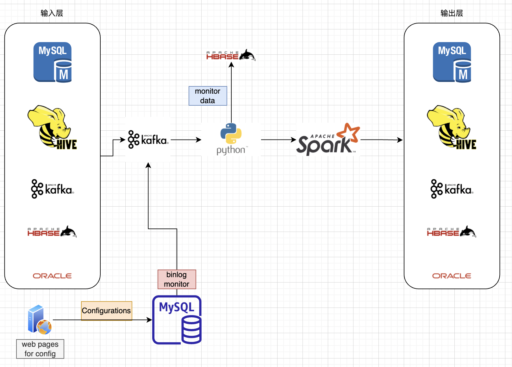

## bigdata platform implement

### overview

There is a citi platform that need a bigdata platform that could implement `ETL` logic that could support different business usecase, a main platform could support a web page that drag and put a button with different functionality and also with connections, for now try with only backend logic that supported.

There will be different input and output sources supported like HIVE, JDBC, MYSQL, ORACLE, HBASE, KAFKA etc.

Will let users just do configurations, then will trigger full process. 

### architecture

Backend engine for now is `Spark`, but will support `Flink` either that support low latency data processing.

### implement details

1. Configurations are stored in `MYSQL`.
2. A monitor tool that get changes records bin log files in `MYSQL`, write changes records into `kafka`
3. Dump records into `HDFS` or other durable file systems, will do checking configurations is supported and right for later usecase, meanwhile will dump records into `HBase` for future bebug. Configurations are stored as a `JSON` format, could re-load JSON file into data structure as needed.  `#todo how to solve dynamic configurations in code? `

### LLM based project implement

Use LLM ability to implement personal recommendation for each user.

For users: 
1. Developers that could data data from database without writing SQL
2. Internal legal users that need to some query for contracts, based on ES and LLM

Solution:
1. `pandasai` that support query without sql
2. `langchain` and `transformers` that do document retrieve based on user query.

### known issues

## future work