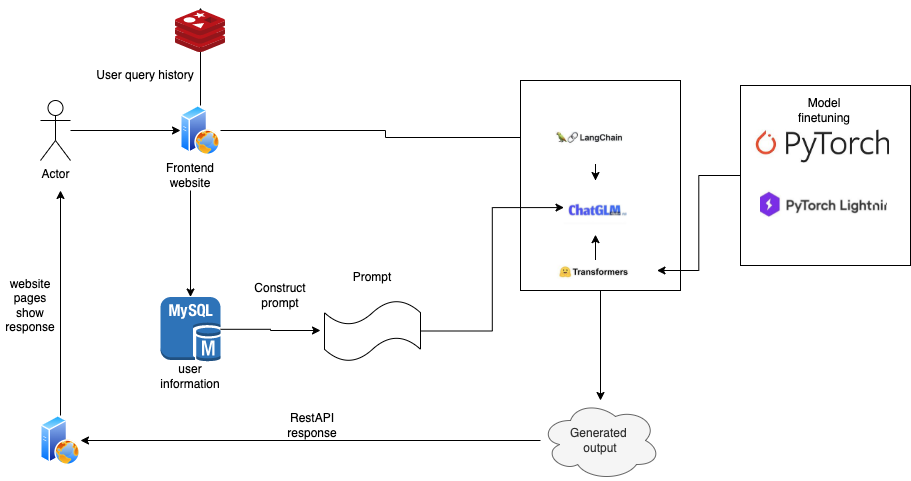

## 2 projects for LLMs

1. `big data platform` that support webpage based ELT workflow
2. `chat-based model` based on langchain and chatglm based on transformer with fine-tuning for bankers

### `chat-based model`

#### Goodness:
- personalized chat and friendly output based on each user
- give user suggestion for finance product? --> should give llm some structured data
- better and satisfied feelings for users

### LLM based project implement

For users: 
1. Developers that could data data from database without writing SQL
2. Internal legal users that need to some query for contracts, based on ES and LLM

#### freeSQL implement

Support user interact with database without writing `SQL` language that could get data result, also support data-plot just like python's `matplotlib`

Solution:
1. `pandasai` that support query without sql
2. `langchain` and `transformers` that do document retrieve based on user query.

#### Process steps:

1. each user login will get user information, then `extract users' information from database`
2. give user a page to chat that also support `historical chat query` search
3. user may have some basic chat entry to describe their needed information
4. `construct prompt` based on user basic information and some historical purchase information as input, also with more other information like user intent, also have to give a output for the prompt
5. based on prompt and user infor to query `LLM model`, and wait the model output
6. construct the output to give user response
7. provide user history information based, as `memory`!

#### tech archicture
1. `langchain` as a chain for user intercative and model query, models are stored in local server! No need to query API to keep data safe.
2. `chatglm` model as base model
3. `transformers` to fine-tuning `chatglm`
4. transformers based `evaluate` to evaluate model output
5. `pytorch` and `pytorch lightning` to distributed fine-tuning for more useful tuning
6. `redis` to store users' historical chat in memory for efficient query
7. `mysql` to store users' basic information
8. todo: a website based page for chat!

### Langchain logic that to process files.
- convert pdf into txt file, based on `pypdf2` that could be used to extract text from pdf
- use `NLP` process to do information extraction for the text to normalize the data, for the query will do the same process.
- construct normalized data into langchain document obj that could be used for later step
- Load text into Document
- split each document into a list of chunks that contains text
- create each chunk into embedding vector, and store them into vectorestore
- create a new query string and get its embedding vector
- use vectorestore to get similary vectors text
- construct prompt with query and some similarity text
- send them into LLM and get returned prediction
- send prediction into frontend

### LLM based project implement

Use LLM ability to implement personal recommendation for each user.

For users: 
1. Developers that could data data from database without writing SQL
2. Internal legal users that need to some query for contracts, based on ES and LLM

Solution:
1. `pandasai` that support query without sql
2. `langchain` and `transformers` that do document retrieve based on user query.

## Tech implement

Build up with docker commands.

#### Mysql with docker
  - start mysql with docker: `docker run -itd --name mysqlnew -p 3306:3306 -e MYSQL_ROOT_PASSWORD=123456 mysql`
  - enter docker container: `docker exec -it mysqlnew bash -l` 
  - enter database: `mysql -u root -p` password: `123456`
  - ensure we could access db: `show databases;`

#### Docker with redis-server
``sh
docker run --name rds -dp 6379:6379 redis/redis-stack-server 

docker start rds
``